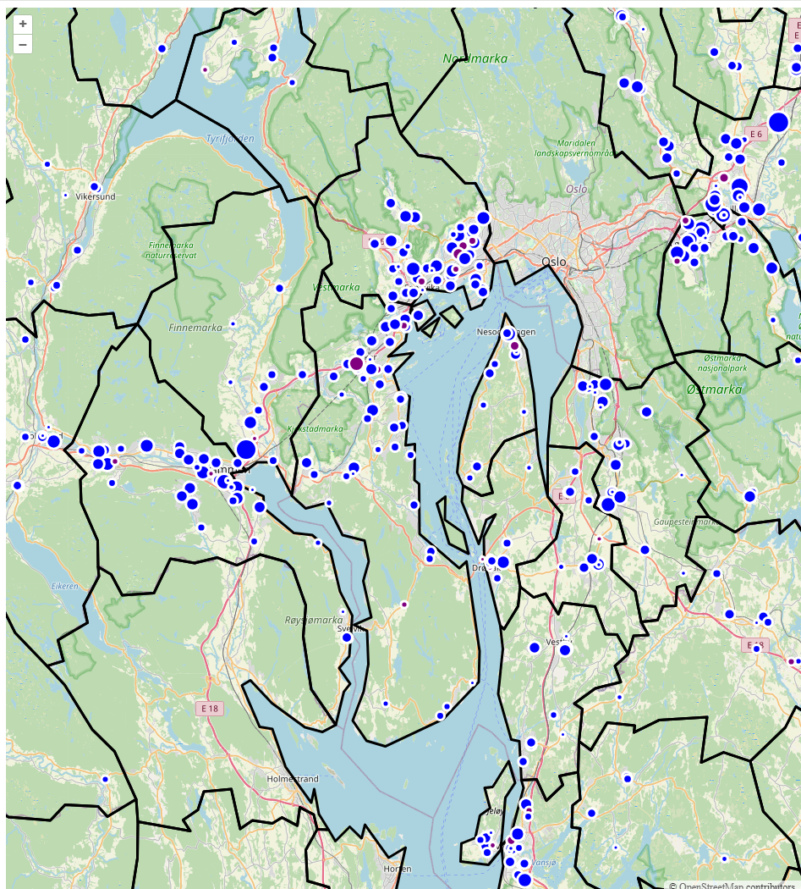

# Displaying map features from a geographical database

This lecture demonstrates how to use the Geographical Database [PostGIS](https://postgis.net)

We will work up to a query that selects the schools in the old administrative regions of Viken:

```postgresql
select skolenavn, eierforhold, antallelever, posisjon::json as geometry
from grunnskole s
    inner join fylke f on st_contains(f.omrade, s.posisjon)
    inner join administrativenhetnavn a on f.objid = a.fylke_fk
        and a.sprak = 'nor'
where a.navn = 'Viken'
```

The result will be something like the following:



## Create a basic OpenLayers React Application (repetition)

<details>

```shell
npm init -y
npm install -D vite husky typescript prettier vite @types/react @types/react-dom
npm install react react-dom ol

npx husky init
npx tsc --init
npm pkg set type=module
npx prettier --write .
npm pkg set scripts.test="tsc --noEmit && prettier --check .

npm pkg set scripts.dev=vite

```

**`index.html`**

```html
<html lang="en">
  <body>
    <div id="app"></div>
  </body>
  <script src="src/main.tsx" type="module"></script>
</html>
```

**`src/main.tsx`**

```tsx
import { createRoot } from "react-dom/client";
import { useEffect, useRef } from "react";
import { Map, View } from "ol";
import { useGeographic } from "ol/proj.js";
import TileLayer from "ol/layer/Tile.js";
import { OSM } from "ol/source.js";

import "ol/ol.css";
import VectorLayer from "ol/layer/Vector.js";

useGeographic();
const kommuneLayer = new VectorLayer();
const grunnskoleLayer = new VectorLayer();
const map = new Map({
  view: new View({ center: [10.7, 59.9], zoom: 8 }),
  layers: [new TileLayer({ source: new OSM() }), kommuneLayer, grunnskoleLayer],
});

function Application() {
  const mapRef = useRef<HTMLDivElement | null>(null);
  useEffect(() => map.setTarget(mapRef.current!), []);
  return <div ref={mapRef}></div>;
}

createRoot(document.getElementById("app")!).render(<Application />);
```

</details>

## Warm-up: Display kommuner

1. Download [`/public/geojson/kommuner.geojson`](https://github.com/robhop/fylker-og-kommuner/blob/main/Kommuner-S.geojson)
2. Add `*.geojson` to `.prettierignore`
3. Update kommunelayer:
   ```tsx
   const kommuneLayer = new VectorLayer({
     source: new VectorSource({
       url: "/geojson/kommuner.geojson",
       format: new GeoJSON(),
     }),
   });
   ```

(Take a look at http://localhost:5173/geojson/kommuner.geojson to be reminded what GeoJSON looks like)

## Create a PostGIS database

1. Download and install [Docker Desktop](https://docs.docker.com/desktop/)
2. Define `docker-compose.yaml`
   ```yaml
   services:
     kws2100:
       container_name: postgis
       image: postgis/postgis
       ports:
         - "5432:5432"
       environment:
         POSTGRES_PASSWORD: password
         POSTGRES_HOST_AUTH_METHOD: trust
   ```
3. `docker compose up` starts the database
4. In IntelliJ, connect to the database under View > Tool Windows > Database, select + > Data Source > PostgreSQL
5. Define a `package.json` script to download [grunnskoler from GeoNorge](https://kartkatalog.geonorge.no/metadata/grunnskoler/db4b872f-264d-434c-9574-57232f1e90d2)
   1. `npm install -D download-cli`
   2. `npm pkg set scripts.layer:grunnskoler:download="download --extract --out tmp https://nedlasting.geonorge.no/geonorge/Befolkning/Grunnskoler/PostGIS/Befolkning_0000_Norge_25833_Grunnskoler_PostGIS.zip"`
6. `npm run layer:grunnskoler:download` will result in a SQL file in the `tmp/` folder (`tmp` should be added to `.gitignore`)
7. Define a `package.json` script to load the SQL file into the docker hosted database
   1. `npm pkg set scripts.layer:grunnskoler:import="docker exec -i /postgis /usr/bin/psql --user postgres < tmp/Befolkning_0000_Norge_25833_Grunnskoler_PostGIS.sql"`
8. `npm run layer:grunnskoler:import` will result in a new schema named something like `grunnskoler_vsgdsgat` in your database
9. Repeat the `download` and `import` scripts for [fylker from 2023](https://kartkatalog.geonorge.no/metadata/administrative-enheter-fylker-historiske-data-2023/7284fe8e-fed6-4172-ae56-a7f7c9fd4759)
   1. `npm pkg set scripts.psql="docker exec -i /postgis /usr/bin/psql --user postgres"`
   2. `npm pkg set scripts.layer:fylker2023:import="npm run psql < tmp/Basisdata_0000_Norge_25833_Fylker_PostGIS.sql"`
10. You can now try the SQL query above (notice that you must add the fylke and grunnskole schemas to your query):
    ```postgresql
    select a.navn, skolenavn, eierforhold, antallelever, posisjon::json as geometry
    from grunnskole s
        inner join fylke f on st_contains(f.omrade, s.posisjon)
        inner join administrativenhetnavn a on f.objid = a.fylke_fk
            and a.sprak = 'nor'
    ```

## Creating an API with Hono

We will use [Hono](https://hono.dev) as an API server

### Create a server project

```shell
mkdir server
cd server
npm init -y
npm pkg set type=module
npm install -D tsx
npm install hono @hono/node-server
npm pkg set scripts="tsx --watch server.ts
```

### Create `server/server.ts`

```ts
import { Hono } from "hono";
import { serve } from "@hono/node-server";

const app = new Hono();
app.get("/api/grunnskoler", async (c) => {
  return c.json({ hello: "world" });
});
serve(app);
```

### Test it out

1. `cd server`
2. `npm run dev`
3. Go to http://localhost:3000/api/grunnskoler

### Expose the API through Vite

Create a `vite.config.ts` which forwards (proxies) all requests to /api to Hono:

```ts
import { defineConfig } from "vite";

export default defineConfig({
  server: {
    proxy: { "/api": "http://localhost:3000" },
  },
});
```

Restart Vite and test it out by going to http://localhost:5173/api/grunnskoler

## Displaying the schools for real

We need to update `/api/grunnskoler` to actually return the information that we want, we then need the `grunnskoleLayer` to display these correctly.

**Update the `/api/grunnskoler` route in `server/server.ts`:**

```ts
app.get("/api/grunnskoler", async (c) => {
  const result = await postgresql.query(
    `select  skolenavn, eierforhold, antallelever, posisjon::json as geometry
     from grunnskoler_1a0d38b7214c4b4fbd0bc9f3a77f3ad6.grunnskole s
     `,
  );
  return c.json({
    type: "FeatureCollection",
    features: result.rows.map(({ geometry, ...properties }) => ({
      type: "Feature",
      properties,
      geometry,
    })),
  });
});
```

**Update the `grunnskoleLayer` in `src/main.tsx`**

We run into a problem here, which we will explore more in the future: The positions given in our dataset is given as meters in the projection UTM 33 (Universal Transverse Mercator centered on 15° east),
also known as `EPSG:25833`. However, OpenLayers expects to get coordinates in degrees latitude and longitude, also
known as `EPSG:4326` and display them in the Web Mercator projection, also known as EPSG 3857.

(These numbers will appear every now and then when you deal with geographical data)

To deal with this, we need to 1) tell OpenLayers how to deal with `EPSG:25833` coordinates,
and 2) tell OpenLayers the coordinate system of this data:

First: run `npm install proj4`

In `src/main.tsx`

```tsx
import proj4 from "proj4";

proj4.defs(
  "EPSG:25833",
  "+proj=utm +zone=33 +ellps=GRS80 +towgs84=0,0,0,0,0,0,0 +units=m +no_defs +type=crs",
);
register(proj4);

const grunnskoleLayer = new VectorLayer({
  source: new VectorSource({
    url: "/api/grunnskoler",
    format: new GeoJSON({ dataProjection: "EPSG:25833" }),
  }),
});
```

## Next steps:

1. To get a better grip of the data, you should add styles to the VectorLayers in OpenLayers
2. To complete the exercise, you have to update the `/api/grunnskoler` to filter for schools in the historical county of Viken

In future lectures we will look at

- How to use an API to load administrative border data smarter
- Alternative ways to deal with the problem of data in several coordinate systems
- How to deploy a Hono application
