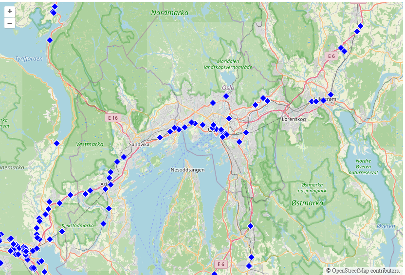

# Lecture 11: Points that move

Here, we update periodically the positions of public transport vehicles in Norway.



ENTUR is a public sector agency that provides [APIs for Norwegian public transport](https://developer.entur.org/). Among
these, there is [an API to fetch vehicle positions](https://developer.entur.org/pages-real-time-intro), using the open
standard [gtfs-realtime (General Transit Feed Specification)](https://gtfs.org/), which is based on the transport
protocol [protobuf](https://protobuf.dev/). We will use
the [protoc - protobuf compiler](https://github.com/protoc olbuffers/protobuf/releases) tool with the
[ts-proto TypeScript library](https://github.com/stephenh/ts-proto) to transform the
[gtfs-realtime.proto API specification](https://github.com/google/transit/blob/master/gtfs-realtime/proto/gtfs-realtime.proto)
into TypeScript.

gtfs-realtime provides a fairly low level interface to the vehicle data, and we will need to work to transform it into
something that OpenLayers will be happy to consume.

#### How to read data from ENTUR

1. Download [`protoc`](https://github.com/protocolbuffers/protobuf/releases) and store it locally (but `.gitignored` - it's pretty big)
2. `npm install ts-proto` for TypeScript bindings
3. Download the [gtfs-realtime.proto spec](https://github.com/google/transit/blob/master/gtfs-realtime/proto/gtfs-realtime.proto)
4. Run `protoc --plugin=./node_modules/.bin/protoc-gen-ts_proto --ts_proto_out=generated/ --ts_proto_opt=esModuleInterop=true ./gtfs-realtime.proto`
   - Note: ⚠ On Windows, you have to replace `protoc-gen-ts_proto` with `protoc-gen-ts_proto.cmd`, so the full command is
     `protoc --plugin=./node_modules/.bin/protoc-gen-ts_proto.cmd --ts_proto_out=generated/ --ts_proto_opt=esModuleInterop=true ./gtfs-realtime.proto`
   - Note: You may want to add a `script` in `package.json` for this
5. Read the binary data from ENTUR: `const res = await fetch("https://api.entur.io/realtime/v1/gtfs-rt/vehicle-positions")`
6. Parse the data using the generated spec: `FeedMessage.decode(new Uint8Array(await res.arrayBuffer()))`
7. Create features using `vehicle.position.longitude` and `vehicle.position.latitude` from `Feedmessage.entity`

Complete code:

```typescript
const res = await fetch(
  "https://api.entur.io/realtime/v1/gtfs-rt/vehicle-positions",
);
const features = FeedMessage.decode(new Uint8Array(await res.arrayBuffer()))
  .entity.map((e) => e.vehicle)
  .filter((e) => !!e)
  .map((vehicle) => {
    const position = vehicle?.position!;
    const { latitude, longitude } = position;
    // Here you may want to include other properties in the Feature
    return new Feature({ geometry: new Point([longitude, latitude]) });
  });
const vectorSource = new VectorSource({ features });
```
