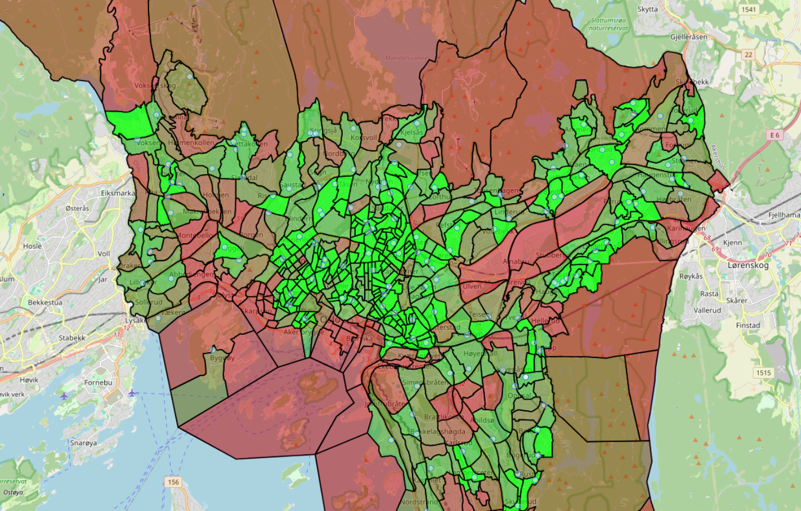

# Lecture 10: Geographical queries

Here, we count the percentage of addresses in each statistical geographical area in Oslo which are more than 500 meters away from the closest school.



This is based on the following SQL query:

```sql
with data
       as (select grunnkretsnummer,
                  grunnkretsnavn,
                  omrade_3857,
                  (select count(*)
                   from vegadresse
                   where st_within(representasjonspunkt_4326, omrade_4326))
                    as antall_adresser,
                  (select count(*)
                   from vegadresse
                          left outer join grunnskole
                                          on st_dwithin(representasjonspunkt_25832, posisjon_25832, 500)
                   where st_within(representasjonspunkt_4326, omrade_4326)
                     and skolenavn is null)
                    as antall_med_skole_over_500m
           from grunnkrets)
select data.*, (antall_med_skole_over_500m::float / antall_adresser) andel_med_skole_over_500m
from data
where antall_adresser > 0
```

This is based on the inner query:

```sql
select grunnkretsnummer,
       grunnkretsnavn,
       (select count(*)
        from vegadresse
               left outer join grunnskole
                               on st_dwithin(representasjonspunkt_25832, posisjon_25832, 500)
        where st_within(representasjonspunkt_4326, omrade_4326)
          and skolenavn is null)
         as antall_med_skole_over_500m
from grunnkrets
```

This counts the number of addresses in a grunnkrets that don't have a school within 500 meters.
The larger query summarizes this information to percentages.
